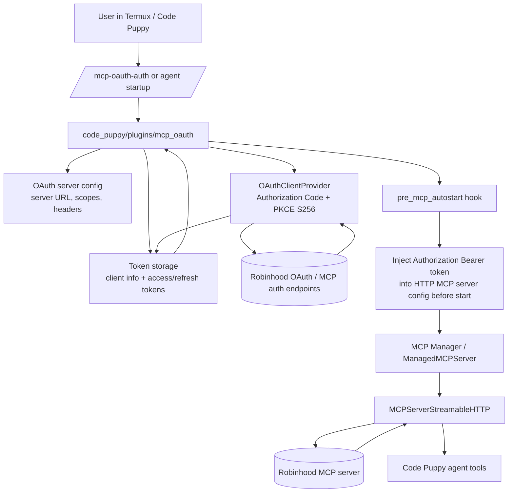

# MCP OAuth / HTTP client report

## Scope
Inspected:
- `pyproject.toml`
- `code_puppy/mcp_/managed_server.py`
- `code_puppy/mcp_/manager.py`
- `code_puppy/mcp_/async_lifecycle.py`
- `code_puppy/http_utils.py`
- `code_puppy/plugins/mcp_oauth/*`
- installed `mcp` / `pydantic_ai.mcp` library code in the active virtualenv

## A. What already exists

### 1. Dependency surface is already present
`pyproject.toml` already includes:
- `pydantic-ai-slim[openai,anthropic,mcp]==1.56.0`
- `mcp>=1.9.4`
- `httpx[http2]>=0.24.1`

So there is no missing base dependency for MCP OAuth support.

### 2. Code Puppy already has an HTTP MCP implementation
For MCP servers with `type == "http"`, `ManagedMCPServer._create_server()` creates:
- `MCPServerStreamableHTTP`

It passes:
- `url`
- `tool_prefix`
- optional `timeout`
- optional `read_timeout`
- optional `headers`

Connection lifecycle is already wired:
1. server object created in `code_puppy/mcp_/managed_server.py`
2. started in `code_puppy/mcp_/manager.py`
3. async context entered in `code_puppy/mcp_/async_lifecycle.py`

### 3. Installed MCP libraries already support the required OAuth primitives
Confirmed from the installed `mcp` package:
- OAuth 2.0 Authorization Code: **yes**
- PKCE (`S256`): **yes**
- `OAuthClientProvider`: **yes**
- token persistence abstraction (`TokenStorage`): **yes**
- token refresh (`refresh_token` grant): **yes**

### 4. Code Puppy already has a generic MCP OAuth plugin
Existing plugin:
- `code_puppy/plugins/mcp_oauth/config.py`
- `code_puppy/plugins/mcp_oauth/oauth_flow.py`
- `code_puppy/plugins/mcp_oauth/register_callbacks.py`
- `code_puppy/plugins/mcp_oauth/storage.py`

Current plugin features:
- parses per-server OAuth config from MCP server config
- performs OAuth using `mcp.client.auth.OAuthClientProvider`
- uses Authorization Code + PKCE
- persists tokens and client info per server
- supports token refresh
- exposes commands:
  - `/mcp-oauth-auth <server>`
  - `/mcp-oauth-status [server]`
  - `/mcp-oauth-logout <server>`
- hooks `pre_mcp_autostart` to prepare auth before bound MCP servers start

### 5. Current runtime auth strategy already works for simple bearer-header servers
The plugin currently:
1. obtains/refreshes an access token
2. clones the MCP server config
3. injects `Authorization: Bearer <token>` into headers
4. recreates the managed MCP server object before startup

For a remote streamable HTTP MCP server that only needs bearer auth, this is the smallest working integration shape.

## B. What is missing

### 1. No first-class direct OAuth binding inside the HTTP MCP server object
Code Puppy does **not** currently bind `OAuthClientProvider` directly into the `MCPServerStreamableHTTP` session used for normal MCP traffic.

Instead, it does OAuth out-of-band, then injects a static bearer token into headers.

Implication:
- current design is good for bearer-token handoff
- it is not a first-class "the MCP client itself performs the OAuth auth flow during connection" integration

### 2. HTTP streamable MCP path does not currently use Code Puppy's custom async HTTP client
For SSE, Code Puppy can build and pass a custom `httpx.AsyncClient`.

For HTTP streamable MCP, current code deliberately avoids `http_client=` and passes only `headers=` because of the integration bug noted in `managed_server.py`.

Implication:
- HTTP streamable MCP is currently more constrained than SSE
- Code Puppy's retry/proxy/client customization path is not the primary HTTP MCP path

### 3. Runtime bearer injection relies on private managed-server mutation
`register_callbacks._apply_runtime_bearer()` currently mutates:
- `managed.config`
- `managed._pydantic_server`
- then calls `managed._create_server()`

That is acceptable before startup, but it is not a clean public hot-reload API.

Implication:
- safe-ish as a pre-start hook
- not ideal as a live-running reconfiguration mechanism

### 4. Token file permissions are not explicitly hardened
`storage.py` creates and writes token JSON files, but does not explicitly enforce restrictive permissions on:
- storage directory
- token files

### 5. No real end-to-end integration test with a protected HTTP MCP server
There are useful unit tests for config/storage/header injection.
There is not yet a full integration test proving:
- OAuth challenge
- token exchange
- refresh
- authenticated streamable HTTP MCP session establishment

### 6. Provider-specific Robinhood unknowns remain
Even though the library and plugin support the core OAuth mechanics, Robinhood-specific unknowns still exist:
- exact scopes required
- client registration expectations
- whether bearer auth alone is sufficient for the MCP session
- whether any extra session header semantics are required

## C. Smallest patch required

## Bottom line
For Robinhood-style remote HTTP MCP auth, the repo is **mostly already there**.
This is not a greenfield feature. It is a small hardening / cleanup job.

### Smallest production-quality patch
1. **Keep the existing plugin architecture**
   - do not move this into core CLI code
   - do not rewrite MCP management

2. **Restrict runtime bearer injection to pre-start use**
   - in `_apply_runtime_bearer()`, detect if the managed server is already running
   - if running, refuse mutation and emit a clear restart warning
   - keep the current recreate-server approach only for not-yet-started servers

3. **Harden token storage permissions**
   - create storage dir with `0700`
   - write token files with `0600`

4. **Document v1 scope honestly**
   - explicitly say the validated path is remote `type: "http"` MCP with bearer auth
   - do not oversell generic SSE parity unless separately validated

### What does *not* need to be built from scratch
- OAuth Authorization Code flow
- PKCE
- token refresh
- token persistence model
- per-server OAuth config parsing
- pre-autostart auth hook

### When a larger patch would be required
A larger patch is only needed if Robinhood requires more than bearer-header injection, such as:
- auth handled directly by the MCP transport on each request
- custom HTTP client behavior for streamable HTTP
- special session continuity beyond bearer tokens

If bearer auth alone is sufficient, the smallest patch is just hardening the current plugin path, not redesigning the whole stack.

## D. Approach comparison (in progress)

### Option A: Native Code Puppy OAuth support
Definition:
- Code Puppy owns the OAuth experience and lifecycle directly.
- In this repo, that effectively means building on the existing `code_puppy/plugins/mcp_oauth/` path rather than relying on an external sidecar or manual token minting flow.

Strengths:
- best user experience inside Code Puppy
- reuses already-existing plugin/auth/storage/hooks
- keeps token refresh and status visibility in one place
- smallest conceptual gap from the current codebase

Weaknesses:
- still needs small hardening work before calling it production-clean
- current HTTP streamable path uses bearer injection rather than first-class transport-bound OAuth
- mutating managed server internals is a little cowboy if done after startup

Initial verdict:
- **Best default direction** for this repo, as long as the implementation stays plugin-first and the patch remains small.

### Option B: OAuth bridge plugin
Definition:
- A dedicated bridge plugin handles provider-specific OAuth/session behavior and then hands Code Puppy an authenticated MCP-ready surface.
- This can mean translating provider quirks, minting or refreshing tokens externally, or acting as an adaptation layer between Robinhood auth behavior and Code Puppy's MCP binding flow.

Strengths:
- isolates provider-specific weirdness better than pushing it deeper into generic MCP management
- can be a good fit if Robinhood needs more than plain bearer-header injection
- keeps the blast radius smaller than a core rewrite
- can evolve independently if the provider auth flow changes often

Weaknesses:
- overlaps with the existing `mcp_oauth` plugin unless responsibilities are drawn very clearly
- risks violating DRY by duplicating token storage, refresh, or command UX that already exists
- adds another abstraction layer even though the current repo already has a mostly-working native plugin path
- can become an accidental sidecar architecture if it grows beyond a thin adapter

Comparison vs Option A:
- If Robinhood works with normal OAuth + bearer auth, **Option A wins** because it is simpler and already mostly implemented.
- If Robinhood requires ugly provider-specific session behavior, **Option B becomes more attractive** because it quarantines that ugliness.
- Option B should only exist if it adds a clearly bounded adapter layer; otherwise it is just Option A wearing a fake mustache.

Current verdict:
- **Option B is a conditional choice, not the default winner.**
- Use it only if Robinhood proves incompatible with the simpler native Code Puppy OAuth path.

### A vs B summary
- **Default recommendation:** Option A
- **Fallback if provider quirks force it:** Option B
- **Reason:** YAGNI. Do not build an auth bridge unless the plain native/plugin path actually fails on real provider behavior.

### Option C: External auth proxy
Definition:
- A separate external service or local proxy handles OAuth, token refresh, and possibly MCP request forwarding, while Code Puppy talks to that proxy instead of handling auth directly.

Strengths:
- strongest isolation between Code Puppy and provider-specific auth complexity
- can centralize credentials and session handling outside the app
- can work even if the provider requires behavior that is awkward to express through Code Puppy's current MCP integration seam

Weaknesses:
- highest operational complexity of the three options
- adds deployment, networking, failure, and debugging overhead
- worst fit for the "smallest patch required" goal
- easiest way to violate YAGNI by building infrastructure before proving it is needed
- creates more moving parts around secrets, availability, and local/mobile usability

Comparison vs A and B:
- Compared with **Option A**, Option C is far heavier and only makes sense if native/plugin support is blocked by hard protocol or provider constraints.
- Compared with **Option B**, Option C goes one step further by moving auth behavior outside Code Puppy entirely.
- If the user is operating from Termux/on-phone, Option C is especially unattractive unless absolutely necessary.

Current verdict:
- **Option C is the least preferred default.**
- Use it only if both Option A and Option B fail to satisfy real Robinhood constraints.

### A vs B vs C summary
- **Preferred default:** Option A
- **Use if provider quirks demand an adapter:** Option B
- **Use only if in-process/plugin approaches cannot work:** Option C
- **Reason:** start with the smallest repo-native solution, then escalate only when reality forces it.

## E. Ranking

### By development effort
1. **Option A — Native Code Puppy OAuth support**
   - Lowest effort because most of the implementation already exists in `code_puppy/plugins/mcp_oauth/`.
   - Remaining work is mainly hardening, cleanup, and provider validation.

2. **Option B — OAuth bridge plugin**
   - Medium effort because it adds a new adaptation layer.
   - Could reuse some existing auth pieces, but only if responsibilities are kept very clear.
   - Higher effort than A because it introduces more design work and more moving parts.

3. **Option C — External auth proxy**
   - Highest effort because it creates a separate system boundary.
   - Requires proxy/service behavior, deployment/runtime management, and more integration/debugging work.
   - Worst fit for the "smallest patch required" objective.

### By maintainability
1. **Option A — Native Code Puppy OAuth support**
   - Best maintainability if kept plugin-first.
   - Reuses the repo's existing auth, storage, and MCP hook seams without adding another architectural layer.
   - Fewer moving parts means fewer places for bugs and drift to breed.

2. **Option B — OAuth bridge plugin**
   - Maintainable only if it stays a thin, clearly bounded adapter.
   - Better than C because it remains inside the Code Puppy plugin model.
   - Worse than A because it risks duplicating logic already present in `mcp_oauth` unless responsibilities are ruthlessly separated.

3. **Option C — External auth proxy**
   - Lowest maintainability because it introduces another deployable boundary.
   - More components, more config, more logs, more failure modes, more "why is this even here" energy.
   - Especially poor fit if the simpler in-process options already satisfy the real requirements.

### By security
1. **Option A — Native Code Puppy OAuth support**
   - Best security *for this repo and workflow* if hardened properly.
   - Keeps secrets handling local to Code Puppy without adding another network hop or extra service boundary.
   - Smallest attack surface of the three, assuming token file permissions are fixed and runtime mutation is constrained.

2. **Option B — OAuth bridge plugin**
   - Potentially secure, but only if it is a thin adapter and does not duplicate token handling sloppily.
   - Better isolation for provider-specific quirks can help, but extra logic also means extra places to mishandle secrets.
   - Security outcome depends heavily on disciplined scope boundaries.

3. **Option C — External auth proxy**
   - Can be made secure in theory, but is the riskiest default choice here because it expands the trust boundary.
   - Adds another process/service that can leak, log, cache, or mishandle tokens.
   - More infrastructure means more secret surfaces and more operational mistakes waiting to happen.

### By mobile / Termux friendliness
1. **Option A — Native Code Puppy OAuth support**
   - Best fit for a phone/Termux workflow.
   - Keeps everything inside the existing app and plugin model.
   - Lowest setup burden, fewest extra processes, and least networking nonsense to babysit on mobile.

2. **Option B — OAuth bridge plugin**
   - Still plausible on Termux if it remains an in-process plugin or very thin adapter.
   - Less friendly than A because it introduces more conceptual and operational complexity.
   - Acceptable only if Robinhood-specific quirks really require the extra layer.

3. **Option C — External auth proxy**
   - Worst fit for mobile / Termux.
   - Separate proxy/service management on a phone is exactly the kind of avoidable pain nobody should volunteer for.
   - Highest setup friction, highest operational annoyance, and weakest ergonomics for this user environment.

## F. Final recommendation

### Recommend exactly one architecture
**Option A — Native Code Puppy OAuth support**

### Why this is the correct choice
- It is the **lowest development effort** because most of the implementation already exists.
- It is the **most maintainable** because it stays inside the current plugin/hook architecture.
- It is the **best security fit** for this repo because it avoids adding another trust boundary.
- It is the **best Termux/mobile fit** because it does not require an external service.
- It satisfies the project's stated goal of the **smallest production-quality patch**.

### Recommended implementation shape
Use the existing `code_puppy/plugins/mcp_oauth/` plugin as the architecture of record, and harden it rather than replacing it.

Concretely:
1. keep OAuth in the plugin layer
2. keep pre-start bearer injection for remote HTTP MCP servers
3. block unsafe live mutation of already-running servers
4. harden token storage permissions
5. validate Robinhood-specific behavior before adding any bridge or proxy architecture

### Explicit non-recommendation
- Do **not** choose Option B first unless Robinhood proves the native/plugin path is insufficient.
- Do **not** choose Option C unless both in-process/plugin approaches fail on real provider constraints.

### Short version
Start with the thing that already mostly works. Do not build extra auth machinery just because the future might be annoying.

## G. Architecture diagram

### Recommended architecture: Option A — Native Code Puppy OAuth support

### Runtime sequence
1. User authenticates once, or startup triggers auth readiness.
2. `mcp_oauth` plugin runs OAuth Authorization Code + PKCE.
3. Tokens and client info are persisted locally.
4. Before MCP autostart, plugin injects a bearer token into the HTTP MCP server config.
5. Code Puppy starts `MCPServerStreamableHTTP`.
6. Agent uses authenticated Robinhood MCP tools through the normal MCP manager path.

### Important boundary
- OAuth is handled in the **plugin layer**.
- MCP transport remains the normal Code Puppy HTTP MCP path.
- The current recommended design is **pre-start token injection**, not a separate proxy or bridge service.

## H. Affected files

### Files likely affected by the recommended patch (Option A)

#### Primary implementation files
- `code_puppy/plugins/mcp_oauth/register_callbacks.py`
  - to constrain bearer injection to pre-start / non-running servers
  - to improve operator messaging around restart requirements

- `code_puppy/plugins/mcp_oauth/storage.py`
  - to harden token storage file and directory permissions

#### Possible documentation files
- `code_puppy/plugins/mcp_oauth/README.md`
  - to document the validated HTTP MCP + bearer-auth scope and usage expectations

- `README.md`
  - only if the main repo docs should mention OAuth-backed MCP server setup

#### Possible test files
- `tests/plugins/test_mcp_oauth_plugin.py`
  - to add coverage for pre-start-only mutation rules
  - to add coverage for token storage permission handling if implemented in a testable way

### Files inspected but not necessarily needing changes
- `code_puppy/mcp_/managed_server.py`
- `code_puppy/mcp_/manager.py`
- `code_puppy/mcp_/async_lifecycle.py`
- `code_puppy/http_utils.py`
- `code_puppy/plugins/mcp_oauth/config.py`
- `code_puppy/plugins/mcp_oauth/oauth_flow.py`
- `pyproject.toml`

### Not recommended to change first
- core CLI entrypoints under `code_puppy/command_line/`
- broad MCP manager architecture files unless Robinhood proves the plugin seam is insufficient

## I. Implementation plan

### Goal
Harden the existing native Code Puppy OAuth plugin path for remote HTTP MCP servers without redesigning the MCP stack.

### Phase 1 — Guard the current runtime mutation seam
1. Update `code_puppy/plugins/mcp_oauth/register_callbacks.py`
2. Detect whether the target managed MCP server is already running before applying bearer-token mutation
3. If the server is already running:
   - refuse live mutation
   - emit a clear operator message explaining that restart is required
4. Keep the current config-clone + recreate-server behavior only for pre-start flows

**Reason:**
This preserves the smallest working design while removing the sketchiest lifecycle behavior.

## J. Estimated lines changed

### Estimated patch size for the recommended architecture (Option A)

#### Core implementation
- `code_puppy/plugins/mcp_oauth/register_callbacks.py` (currently 229 lines)
  - estimated change: **15–35 lines**
  - scope: running-server guard, clearer restart messaging, small control-flow adjustments

- `code_puppy/plugins/mcp_oauth/storage.py` (currently 130 lines)
  - estimated change: **10–25 lines**
  - scope: directory/file permission hardening, maybe tiny helper logic

#### Tests
- `tests/plugins/test_mcp_oauth_plugin.py` (currently 191 lines)
  - estimated change: **20–50 lines**
  - scope: pre-start-only mutation tests, permission tests where practical

#### Docs
- `code_puppy/plugins/mcp_oauth/README.md` (currently 55 lines)
  - estimated change: **10–25 lines**
  - scope: validated support statement and operator expectations

- `README.md` (currently 792 lines)
  - estimated change: **0–15 lines**
  - scope: optional top-level mention only; not required for the smallest patch

### Total estimate
- **Minimum likely change:** ~**55 lines**
- **Comfortable realistic range:** ~**75–135 lines**
- **Upper bound for this patch if kept disciplined:** ~**150 lines**

### Interpretation
This is a **small patch**, not a subsystem rewrite.
If the change set starts drifting far beyond ~150 lines, that is a smell that the scope is expanding or the architecture is getting too clever.

### Phase 2 — Harden token storage
1. Update `code_puppy/plugins/mcp_oauth/storage.py`
2. Ensure the OAuth storage directory is created with restrictive permissions
3. Ensure token files are written with restrictive permissions
4. Preserve current JSON structure and current token refresh behavior

**Reason:**
Secrets should not rely on accidental filesystem defaults. Shocking standard, I know.

### Phase 3 — Document the supported scope honestly
1. Update `code_puppy/plugins/mcp_oauth/README.md`
2. Document that the validated v1 path is:
   - OAuth-backed remote MCP
   - `type: "http"`
   - bearer-token header injection before startup
3. Document operator expectations:
   - first auth may require interactive login
   - token refresh is automatic when possible
   - running servers may need restart after logout/reauth

**Reason:**
Good docs prevent users from discovering edge cases by faceplanting into them.

### Phase 4 — Add targeted tests
1. Update `tests/plugins/test_mcp_oauth_plugin.py`
2. Add coverage for:
   - refusing mutation when a managed server is already running
   - successful bearer injection when server is not running yet
   - token storage permission behavior where practical to test
3. Keep tests focused and small; do not attempt a giant fake-broker integration test in this patch

**Reason:**
This patch should verify the hardening behavior, not cosplay as a full Robinhood lab.

### Phase 5 — Robinhood validation pass
1. Configure a Robinhood MCP server entry using the plugin path
2. Verify:
   - initial interactive auth succeeds
   - refresh works after access-token expiry
   - authenticated HTTP MCP startup succeeds with injected bearer token
3. Only escalate architecture if Robinhood proves bearer injection is insufficient

**Decision gate:**
- If validation succeeds, stop at Option A.
- If validation fails because of provider-specific session quirks, reconsider Option B.
- Only consider Option C if in-process/plugin approaches are conclusively blocked.

### Deliverable order
1. lifecycle guard
2. storage hardening
3. docs update
4. tests
5. Robinhood validation

### Out of scope for this patch
- moving OAuth into core CLI
- replacing the MCP manager architecture
- building an external auth proxy
- implementing a generic bridge layer before there is evidence it is necessary

## K. Risks

### 1. Robinhood may require more than bearer-token injection
**Risk:**
The current recommended design assumes authenticated HTTP MCP access can be established with a valid bearer token injected before startup.

**Impact:**
If Robinhood requires extra session continuity, custom headers, or transport-level auth behavior, Option A may need to be extended or partially reconsidered.

**Mitigation:**
Validate Robinhood early before expanding architecture. Escalate to Option B only if real provider behavior forces it.

### 2. Live managed-server mutation could remain brittle if not tightly constrained
**Risk:**
The current plugin path recreates the managed MCP server object after mutating config. If this is allowed while a server is already running, lifecycle behavior may get weird fast.

**Impact:**
Unexpected runtime behavior, stale connections, or confusing operator experience.

**Mitigation:**
Explicitly block runtime mutation for already-running servers and require restart.

### 3. Token storage secrets could be too exposed without permission hardening
**Risk:**
OAuth token files currently rely on default filesystem behavior.

**Impact:**
Access and refresh tokens may be more exposed than they should be on-device.

**Mitigation:**
Set restrictive directory/file permissions and avoid broadening the number of places where tokens are stored.

### 4. Streamable HTTP path may behave differently from SSE assumptions
**Risk:**
HTTP MCP currently uses header injection rather than Code Puppy's custom async HTTP client path.

**Impact:**
Some auth/client customization assumptions may not transfer cleanly between SSE and streamable HTTP.

**Mitigation:**
Keep docs explicit about validated support scope and test the actual HTTP path, not a generalized fantasy version of it.

### 5. Scope creep could turn a small hardening patch into an architecture rewrite
**Risk:**
Once provider quirks show up, there is a temptation to prematurely invent a bridge or proxy layer.

**Impact:**
More code, more moving parts, slower delivery, and a worse mobile workflow.

**Mitigation:**
Use the decision gate strictly. Stay on Option A unless real evidence forces escalation.

### 6. Mobile / Termux interaction flow may still be awkward during initial auth
**Risk:**
Even with the right architecture, browser/callback flows on mobile can be annoying.

**Impact:**
User friction during first-time setup or reauth.

**Mitigation:**
Keep operator messaging clear, preserve manual callback support, and document the expected flow plainly.

### 7. End-to-end confidence is limited until Robinhood is actually validated
**Risk:**
The repo currently has unit confidence, not full provider confidence.

**Impact:**
A design that looks correct on paper may still fail on provider-specific behavior.

**Mitigation:**
Treat Robinhood validation as a mandatory gate, not a nice-to-have after the patch lands.
